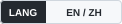
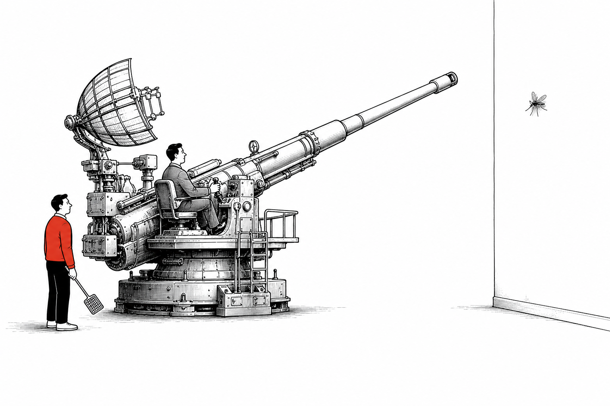
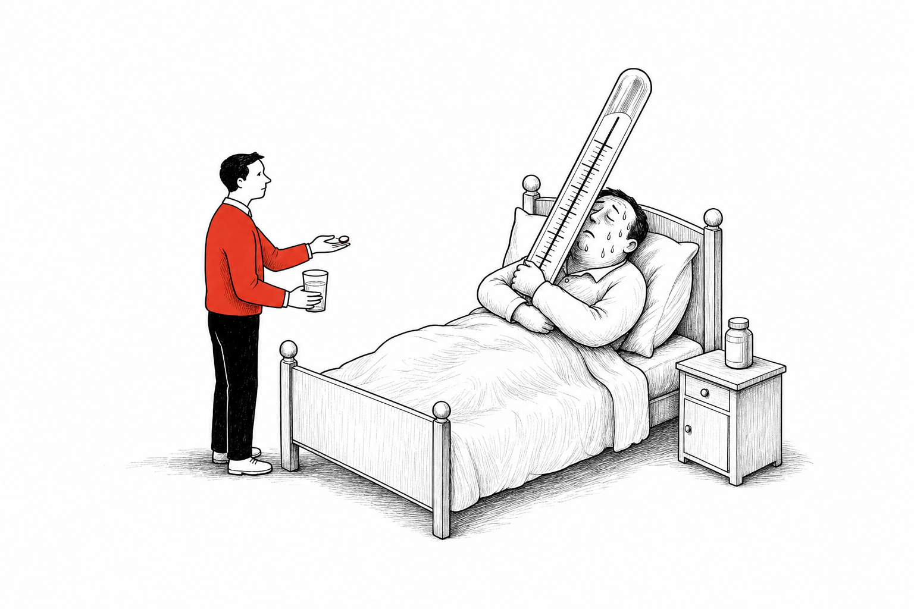
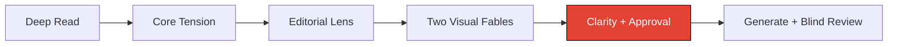

<p align="center"><a name="readme-top"></a><strong>English</strong> · <a href="./README.zh-CN.md">简体中文</a></p>

<h1 align="center">CartoonSynth</h1>

<p align="center">
  <strong>A New Yorker-inspired AI illustration skill for editorial visual fables.</strong><br>
  Turn any abstract idea into a clear, witty red-black scene that reads in three seconds.
</p>

<p align="center">
  
  
  
</p>

<p align="center">
  <a href="./assets/style-anchor-overkill.png"></a>
  <a href="./assets/style-anchor-action.png"></a>
</p>

<p align="center"><sub><strong>Overbuilt solution</strong>: an enormous method attacks a tiny problem. · <strong>Measurement without action</strong>: the problem is measured perfectly and left untreated.</sub></p>

> [!IMPORTANT]
> CartoonSynth is a general editorial illustration workflow for everyday life, relationships, work, business, technology, AI, culture, society, education, creativity, data, and any idea with a visible human contradiction.



## What It Does

CartoonSynth reads a passage, isolates its central contradiction, and turns it into a familiar visual fable. The result should feel like a sharp magazine cartoon rather than an explainer diagram or a pile of style keywords.

The workflow combines:

- New Yorker-inspired editorial wit and visual metaphor
- loose black pen-and-ink lines with light wash
- generous white space and selective vermillion `#E34234`
- Orange Line discipline: one image, one idea, one visible tension
- semantic checks that keep the metaphor faithful to the source
- a three-second no-title test before image generation

## Editorial Lenses

The protagonist and setting follow the source rather than a fixed persona.

| Lens | Typical subjects |
| --- | --- |
| **Everyday life and relationships** | habits, intimacy, expectations, avoidance, self-deception |
| **Workplace and business** | hierarchy, incentives, bureaucracy, customers, organizational theater |
| **Technology and AI** | automation, dependence, control, imitation, unintended consequences |
| **Culture and society** | status, conformity, public performance, institutions, collective behavior |
| **Knowledge and education** | expertise, curiosity, teaching, interpretation, knowing versus doing |
| **Data and measurement** | evidence, metrics, causality, denominators, dashboards, decision gaps |

The familiar red-sweater data analyst remains available as one character preset. It is no longer the default for every topic.

## Why It Is Different

| Mechanism | What it prevents |
| --- | --- |
| **Fable first** | invented symbols that require a legend |
| **Semantic fidelity** | a familiar metaphor silently changing the original claim |
| **Three-second clarity gate** | scenes whose action or absurdity needs explanation |
| **Approval gate** | generating an abstract series before its concepts are understood |
| **Red contract** | unexplained red dots carrying different meanings from image to image |
| **Blind review** | caption-dependent concepts surviving into final artwork |

## Four Modes

| Mode | Best for |
| --- | --- |
| **Explore** | propose two visual fables from different metaphor families |
| **Single** | generate one scene the user has already specified or approved |
| **Series** | establish a visual bible and generate a coherent set in small batches |
| **Revise** | diagnose one failed meaning and save a non-destructive new version |

## Install

Install as a personal Codex skill:

**Windows PowerShell**

```powershell
git clone https://github.com/derrickxu1220/cartoon-synth.git "$env:USERPROFILE/.codex/skills/cartoon-synth"
```

**macOS / Linux**

```bash
git clone https://github.com/derrickxu1220/cartoon-synth.git ~/.codex/skills/cartoon-synth
```

Install inside one project:

```bash
git clone https://github.com/derrickxu1220/cartoon-synth.git .agents/skills/cartoon-synth
```

## Use

### Explore an idea

```text
Use $cartoon-synth to read this essay.
Extract the central contradiction and propose two familiar visual fables
that remain clear without a title. Wait for approval before generating.
```

### Generate a specified scene

```text
Use $cartoon-synth to draw an anti-aircraft gun aimed at a mosquito.
One person operates the enormous weapon while a calm red-sweater observer
stands beside it holding an ordinary flyswatter.
```

### Build a series

```text
Use $cartoon-synth to design one editorial illustration for each of these ten ideas.
Vary the metaphor families, check semantic drift and repetition,
then wait for approval and generate them in batches of two or three.
```

## Visual Language

- 1 to 2 people, one key prop, one dominant action
- loose handmade black contours on pure white
- light wash or sparse hatching only when it improves form
- large negative space and a strong readable silhouette
- one stable vermillion role per image or series
- dry, observational humor rather than mascot-like cuteness
- no title, logo, watermark, dense UI, or infographic layout

## Repository

```text
.
|-- SKILL.md
|-- README.md
|-- README.zh-CN.md
|-- agents/
|   +-- openai.yaml
|-- assets/
|   |-- badge-language.svg
|   |-- badge-method.svg
|   |-- badge-style.svg
|   |-- style-anchor-action.png
|   +-- style-anchor-overkill.png
+-- references/
    |-- cartoonsynth-source.md
    |-- data-metaphors.md
    |-- editorial-lenses.md
    |-- shared-fables.md
    +-- style-guide.md
```

## Notes

CartoonSynth is an independent AI illustration workflow inspired by editorial-cartoon traditions and Orange Line's one-idea discipline. It is not affiliated with or endorsed by *The New Yorker* or any magazine.

<p align="right"><a href="#readme-top">Back to top</a></p>
