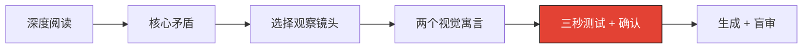

<p align="center"><a name="readme-top"></a><a href="./README.md">English</a> · <strong>简体中文</strong></p>

<h1 align="center">CartoonSynth</h1>

<p align="center">
  <strong>一个创作纽约客插图风视觉寓言的 AI 绘画 skill。</strong><br>
  把任何抽象观点，变成三秒能懂、机智克制的红黑社论场景。
</p>

<p align="center">
  
  
  
</p>

<p align="center">
  <a href="./assets/style-anchor-overkill.png"></a>
  <a href="./assets/style-anchor-action.png"></a>
</p>

<p align="center"><sub><strong>过度复杂的方案</strong>：用庞大的方法攻击极小的问题。 · <strong>只测量不行动</strong>：把问题测量得无比准确，却没有采取行动。</sub></p>

> [!IMPORTANT]
> CartoonSynth 是一套通用的社论插图工作流，可以处理日常生活、关系、职场、商业、科技、AI、文化、社会、教育、创作、数据，以及任何包含鲜明人性矛盾的观点。



## 它能做什么

CartoonSynth 会先阅读内容，找出真正的核心矛盾，再把它转化成一个熟悉的小寓言。最终画面应该像一幅尖锐、克制的杂志社论漫画，而不是解释型图表，也不是一串风格关键词的堆积。

这套工作流结合了：

- 纽约客插图风的社论幽默与视觉隐喻
- 松弛的黑色钢笔线条与轻墨水晕染
- 大面积留白与选择性朱红 `#E34234`
- Orange Line 的纪律：一张图、一个观点、一个可见矛盾
- 防止隐喻改变原意的语义一致性检查
- 图片生成前的三秒无标题测试

## 社论观察镜头

人物和场景跟随文章内容，而不是被锁定成一个固定职业。

| 镜头 | 常见主题 |
| --- | --- |
| **日常生活与关系** | 习惯、亲密、期待、逃避、自欺 |
| **职场与商业** | 层级、激励、官僚主义、客户、组织表演 |
| **科技与 AI** | 自动化、依赖、控制、模仿、意外后果 |
| **文化与社会** | 身份、从众、公共表演、制度、集体行为 |
| **知识与教育** | 专业、自信、好奇、教学、知道与做到 |
| **数据与测量** | 证据、指标、因果、分母、仪表盘、决策落差 |

我们熟悉的红衣数据分析师仍然保留为一个角色预设，但不再是所有主题的默认主角。

## 它为什么不同

| 机制 | 它防止什么 |
| --- | --- |
| **寓言优先** | 发明需要图例才能理解的抽象符号 |
| **语义一致性** | 熟悉的比喻悄悄改变文章原本的观点 |
| **三秒可读性测试** | 动作和荒诞之处必须依靠解释才能看懂 |
| **确认门** | 在构思尚未成立时直接生成整组图片 |
| **红色契约** | 同一个红点在不同图片里承担完全不同的意思 |
| **盲审** | 必须依赖标题或说明文字才能成立的构思 |

## 四种模式

| 模式 | 适合场景 |
| --- | --- |
| **Explore** | 从不同隐喻家族提出两个视觉寓言 |
| **Single** | 用户已经指定或确认场景，生成单张图片 |
| **Series** | 先建立视觉规范，再分批生成统一系列 |
| **Revise** | 诊断一个失败含义，保存不覆盖原图的新版本 |

## 安装

安装为个人 Codex skill：

**Windows PowerShell**

```powershell
git clone https://github.com/derrickxu1220/cartoon-synth.git "$env:USERPROFILE/.codex/skills/cartoon-synth"
```

**macOS / Linux**

```bash
git clone https://github.com/derrickxu1220/cartoon-synth.git ~/.codex/skills/cartoon-synth
```

安装到单个项目：

```bash
git clone https://github.com/derrickxu1220/cartoon-synth.git .agents/skills/cartoon-synth
```

## 使用

### 先探索构思

```text
使用 $cartoon-synth 阅读这篇文章。
提炼最核心的矛盾，提出两个不依赖标题也能看懂的熟悉视觉寓言。
先不要生成图片，等我确认场景。
```

### 直接生成指定场景

```text
使用 $cartoon-synth 画“高射炮打蚊子”。
一个人操作巨大的高射炮瞄准一只蚊子，
红衣观察者站在旁边，手里拿着普通苍蝇拍。
```

### 制作系列

```text
使用 $cartoon-synth 为下面十个观点分别设计一张社论插图。
改变隐喻家族，检查语义跑偏和母题重复，
等我确认后每批生成 2 到 3 张。
```

## 视觉语言

- 1 到 2 个人物、一个关键道具、一个主导动作
- 纯白背景上的松弛黑色手绘轮廓
- 只在有助于塑造形体时使用轻墨水或稀疏排线
- 大面积留白和清晰可辨的剪影
- 每张图或每组图只设定一种稳定的红色作用
- 幽默保持克制、观察式，不走可爱吉祥物路线
- 不要标题、Logo、水印、密集 UI 或信息图布局

## 仓库结构

```text
.
|-- SKILL.md
|-- README.md
|-- README.zh-CN.md
|-- agents/
|   +-- openai.yaml
|-- assets/
|   |-- badge-language.svg
|   |-- badge-method.svg
|   |-- badge-style.svg
|   |-- style-anchor-action.png
|   +-- style-anchor-overkill.png
+-- references/
    |-- cartoonsynth-source.md
    |-- data-metaphors.md
    |-- editorial-lenses.md
    |-- shared-fables.md
    +-- style-guide.md
```

## 说明

CartoonSynth 是一个独立的 AI 插图工作流，借鉴社论漫画传统与 Orange Line 的单一观点纪律，与《纽约客》或任何杂志不存在隶属或背书关系。

<p align="right"><a href="#readme-top">回到顶部</a></p>
